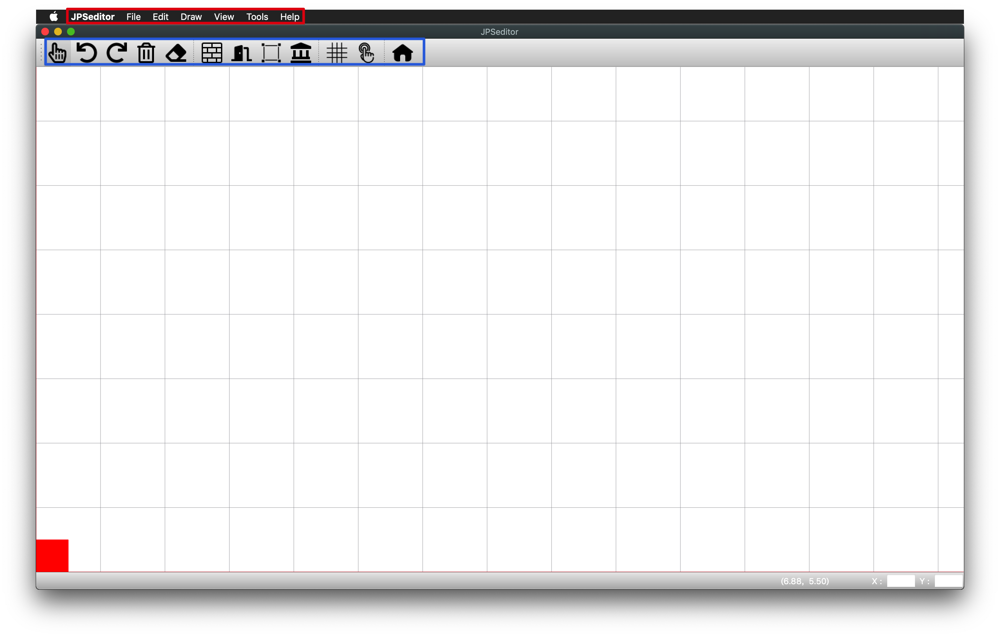

This Quick Start Guide is designed to introduce the key concepts and help you make a quick start with the JPSeditor.

## Step 0. Before you start

### What platforms can I run JPSeditor on?

JPSeditor is a cross-platform GUI programm that works on Windows, macOS, and Linux,

See the installation page to get the latest installation package of JPSeditor or source code.

### What should I know about JPSeditor?

`JPSeditor` is a graphical user interface to create the [geometry](http://www.jupedsim.org/jpscore/2016-11-02-geometry) of a scenario simulated by [JPScore](http://www.jupedsim.org/jpscore/), and creates [project file](http://www.jupedsim.org/jpscore/2016-11-01-inifile) for JPScore.

Before using JPSeditor, you should be familiar with geometry and project file in JPScore. See more information on [JPScore website](http://www.jupedsim.org/jpscore/).

## Step 1. Download the JPSeditor

Whatever OS you are using, we prepared corresponding installation packages.

* For macOS user, download the DMG file here. Double click it to open it and drag the JPSeditor icon in your Application folder in Finder. 
* For windows user, download the rar file here. Extract the package with [7-zip](https://www.7-zip.org/)(A open source compress program), and you will get a folder, run JPSeditor.exe in the folder.
* For Linux user, not matter what Linux distribution you like, you can download open the file, after extracting you will get a [AppImage](https://appimage.org/) file, run the apprun file you can use JPSeditor.

## Step 2. Start drawing in the JPSeditor

In JPSeditor there are three areas: Menu Bar (with red frame) and Tool Bar(with blue frame) and canvas.(grid area)

In the Menu Bar you can find any functions of JPSeditor, in the Tool Bar there are usual tools you need to draw. For example, walls, doors, and help lines.

If you are first time to use JPSeditor, there is a tutorial for basic drawing in JPSeditor.

* [JuPedSim Geometry Editor Tutorial](https://www.youtube.com/watch?v=DR_3TX8MFxM&t=25s)

## Step 3. Draw a complex geometry in JPSeditor

In JPSeditor you can draw anything you need in [JPScore](http://www.jupedsim.org/jpscore/), stairs, 3D rooms. There are three tutorials for a complex geometry:

* [3D room with jpseditor](https://www.youtube.com/watch?v=wK_atSk-xWE)
* [Stairs with jpseditor](https://www.youtube.com/watch?v=DKnJHToLAXs&t=304s)
* [Stairs with jpseditor: automatic room detection](https://www.youtube.com/watch?v=Id5Rfli7UYk)

## Step 4. Know more about JPSeditor and JPScore

As drawing programme for JPScore, a Pedestrian simulation programme, you need know more definitions and usages in JPScore, when you want to draw something in JPSeditor. Thers is a user guide for [JuPedSim](http://www.jupedsim.org/) project, with this guide you will get familiar with functions in JPSeditor.

* [JuPedSim User Guide](https://github.com/JuPedSim/jpseditor/blob/gh-pages/resource/JuPedSim.pdf) 
